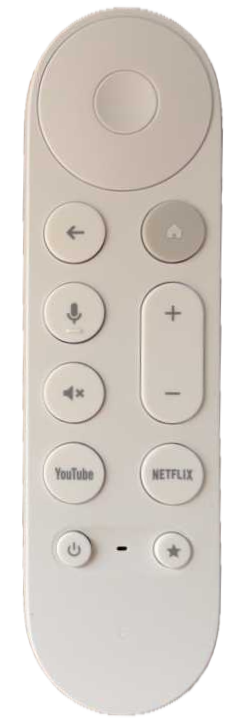

# Google TV Remote

### Quirks

#### Streaming Buttons
Activities are assigned to the usual directional buttons and to the streaming buttons, YouTube and Netflix, and the star button. The streaming buttons are always assigned to activity selection.

#### No Multi-Button Actions
The remote does not support multiple simultaneous button presses. So any Amity multi-button actions are not available when using this remote.

#### No Voice Functionality
Amity does not support voice controls.

### Pairing

1. In the Amity `Remotes` management tab, press the `Pair` button.
2. Place the remote close to Amity and press and hold the `Back` and `Home` buttons for a few seconds.

