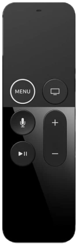

# Siri Remote

## All Generations

### Pairing (and re-pairing)

1. In the Amity `Remotes` management tab, press the `Pair` button.
2. Place the remote close to Amity, and simultaneously press the `Menu/Back` and the `Volume Up (+)` buttons for several seconds.

### Unpairing

Simultaneously press the `Home (TV)` and the `Volume Down (-)` buttons for several seconds.

### No Voice Functionality
Amity does not support voice controls.

## Gen 2 / Gen 3

This is the recommended Siri remote because it has directional buttons and a `Power` button.

## Gen 1

### Quirks

#### Selecting Activities
There are no directional buttons. To select an activity, press the touchpad (making a click) on the part of the touchpad that corresponds to the direction. Press the center for the first activity, towards the top of the touchpad for the second activity, towards the right for the third activity, and so on.

#### Power Button
There is no power button. Triple tap (not press) the touchpad to signal a `Power` button press.

#### No Multi-Button Actions
Amity multi-button actions are not available when using this remote.

