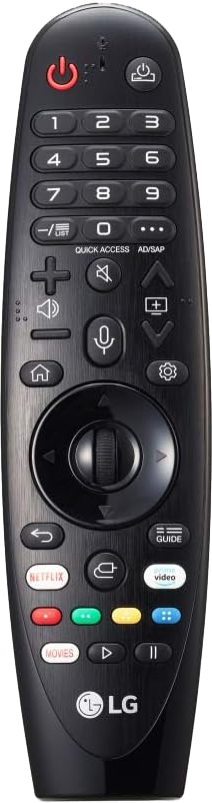
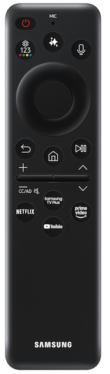
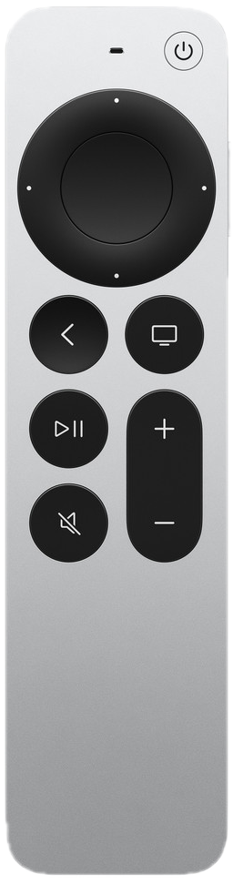
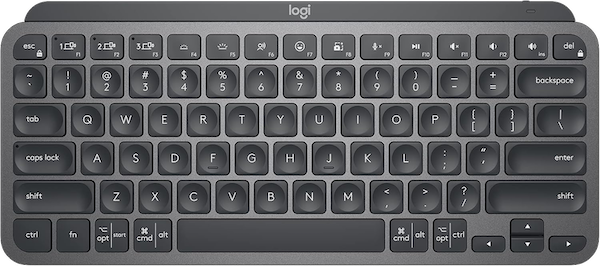

# Supported Remotes

Amity supports several different remotes. Due to differences in how the remotes operate, there can be differences on their use with Amity. Select your remote to read how to pair and use it with Amity.

IR remotes are **not** supported.

* [ Fire TV Remote](fire-tv-remote.md)

* [ LG Magic Remote](lg-magic-remote.md)

* [ Samsung SolarCell/Smart Remote](solarcell.md)

* [ Siri Remote](siri-remote.md)

* [ Keyboards ](keyboards.md)
