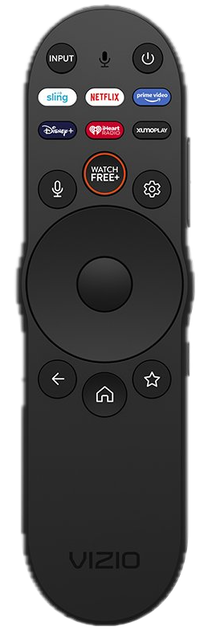

# Vizio XRT270R Remote

This is an especially low cost remote that supports up to seven activities through the use of the streaming buttons. The most of any supported remote.

### Quirks

#### Streaming Buttons
Activities are assigned to the usual directional buttons and to the streaming buttons (Sling, Netflix and Prime Video, etc.). The streaming buttons are always assigned to activity selection.

#### Volume and Mute Button IR
The remote always signals volume controls with infrared (IR) as well as over BLE. The IR signal can inadvertantly control TVs, including non-Vizio TVs. This is typically not a problem when only using a receiver for audio output but it can be confusing when the TV displays its volume slider. To stop the IR from reaching the TV, the remote's IR window on the front can be covered with a small piece of electrical tape.

#### No Multi-Button Actions
The remote does not support multiple simultaneous button presses. So any Amity multi-button actions are not available when using this remote.

#### No Voice Functionality
Amity does not support voice controls.

### Pairing

1. In the Amity `Remotes` management tab, press the `Pair` button.
2. Place the remote close to Amity and press and hold the `Microphone` and `Mute` buttons for a few seconds.

