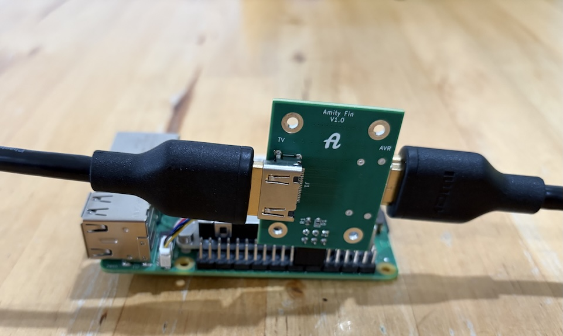
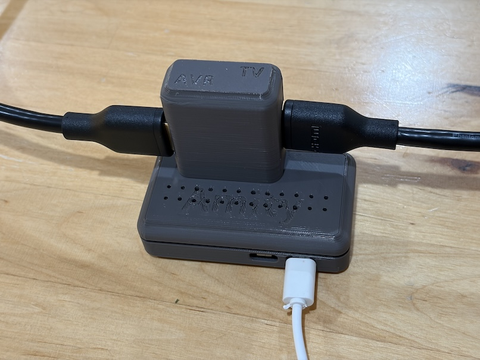

# HDMI-CEC Hardware

!!! Using Amity may destroy your expensive HDMI equipment. Proceed at your own risk !!!

The recommended HDMI-CEC hardware for Amity is Amity Fin. It is the easiest way to connect the Raspberry Pi to your home theater's HDMI.

Alternatively, [Amity Board](board.md) can be used with a wiring harness to connect it to the Raspberry Pi.

It is also possible, but not recommended, to create a standalone wiring harness by stripping and cutting a standard [HDMI cable](cable.md).

Note that all of the commonly available HDMI breakout boards advertised for sale are not designed to pass through high-speed A/V signals, and break video display in an actual home theater.

## Amity Fin

Amity Fin is a 4 layer PCB that includes onboard 27K ohms pullup resistors to conform to the HDMI-CEC specification. When used with the board, Amity must be configured to disable the Raspberry Pi internal GPIO pullup resistors.

### Caveats

Amity Fin is experimental. It has been very lightly tested to work for video up to 4K@60Hz Dolby Vision. EMI is unknown, and it may have other unknown bugs. If you are an experienced HW engineer interested in improving the board design, you are invited to submit improvements.

### Obtaining Amity Fin

A [turnkey project](https://www.pcbway.com/project/shareproject/Amity_Fin_v1_0_a3868150.html) is available for immediate PCB manufacture and component assembly.

Alternatively, you can manufacture Amity Fin with your preferred method. Amity Fin KiCAD files are [here](fin). In the [mfr](fin/mfr) folder are the manufacturing files, and an example BOM for submission to a PCB manufacturer/assembler (the BOM will likely need to be tailored to the manufacturer's requirements).

#### BOM

* 2x [HDMI-A connectors](https://www.digikey.com/en/products/detail/amphenol-cs-fci/10029449-001RLF/1001325)
* 2x [0603 SMD 27K ohms resistors](https://www.digikey.com/en/products/detail/bourns-inc/CR0603-JW-273ELF/3784345)
* 2x [0603 SMD diodes](https://www.digikey.com/en/products/detail/taiwan-semiconductor-corporation/TS4148-RCG/7359811)
* 1x [2.54mm 2x3 connector header](https://www.digikey.com/en/products/detail/sullins-connector-solutions/PPTC032LJBN-RC/775975)

### Mounting Amity Fin

Amity Fin fits over Raspberry Pi header pins 13 - 18. It is mounted with the Amity A graphic facing out from the Raspberry Pi, 6 pins away from the right edge of the header. See the photo for an illustration.

### Amity Fin Mounted on a Raspberry Pi 5

Note the Amity A graphic facing out from the Raspberry Pi, and the 6 pins to the right of the Fin.

### Amity Fin Mounted on a Raspberry Pi Zero 2 W in a Case

STEP files for a 3D printable case for a Raspberry Pi Zero with Amity Fin is available [here](case/).

### Configuring Amity

After [initial installation](../README.md#initial-installation) of Amity, and before plugging in the HDMI connections, Amity must be configured to use Amity Fin.

In the Amity management UI, select the 'Advanced' tab. In the 'HDMI Splice' section press the 'Use with Amity Board' button. When done, the status line should read 'Configured for Amity Board'.