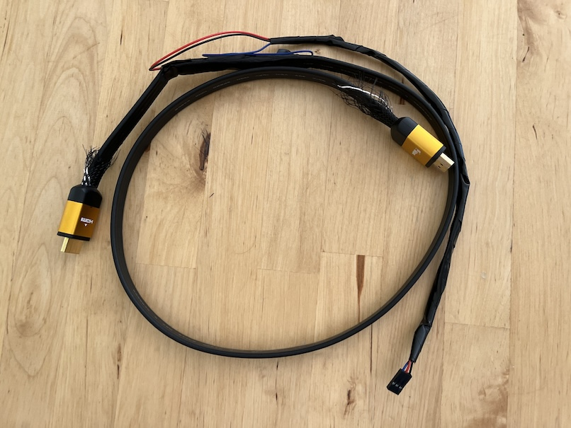
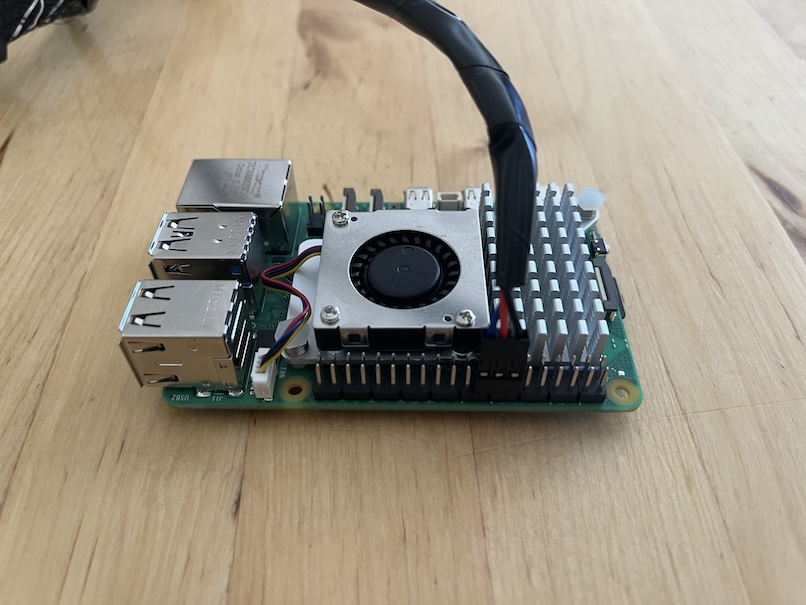
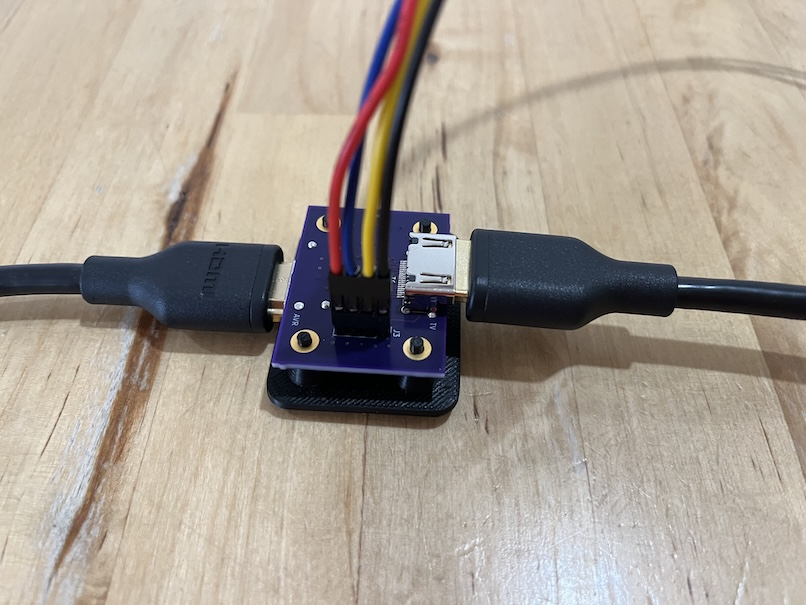
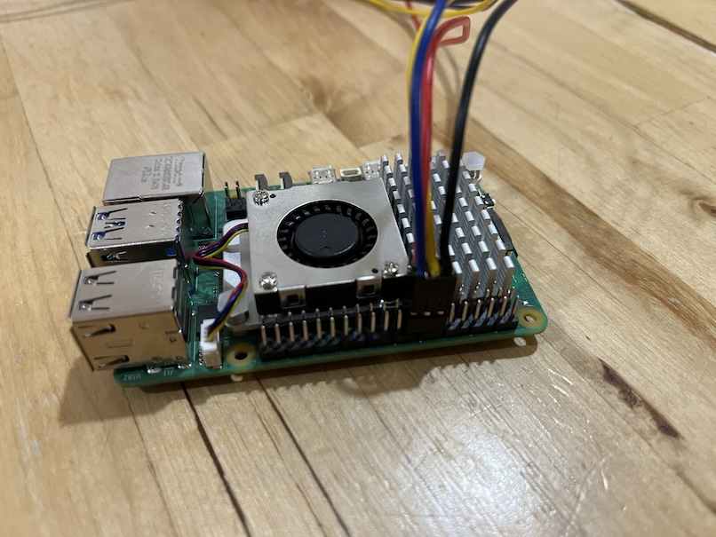

# HDMI-CEC Hardware

## Splicing an HDMI cable

### Caveats

!!! Using Amity may destroy your expensive HDMI equipment. Proceed at your own risk !!!

The spliced HDMI cable method does not conform to the HDMI-CEC specification. In particular, HDMI-CEC specifies the use of 27K ohms pullup resistors for the CEC wires. When using the cable, Amity configures the GPIO pins to use the internal ~60K ohms resistors. This is wildly out of spec. for HDMI-CEC but seems to work anyway.

### Preparation

1. Strip an HDMI cable with a sharp knife.
2. Identify, and carefully pull out the CEC, and ground wires without disturbing the other wires in the cable. Identifying the correct wires can be tricky. One way is to buy a cheap labeled HDMI breakout board and two identical HDMI cables. Cut completely through one of the HDMI cables. Attach one half to the breakout board and identify the colors of the ground, and CEC wires by testing continuity with a multimeter between the labeled breakout board pins, and the exposed HDMI wires. Carefully, strip the second HDMI cable and isolate the ground and CEC wires based on the previously identified colors.
3. Cut the CEC wire to create two ends that connect to the Raspberry Pi GPIO pins.
4. DO NOT cut the ground wire - carefully strip the wire, and connect a wire from the Raspberry Pi ground to the intact ground wire.
5. With power off, connect the two CEC wires (one connected to the TV, and the other connected to the receiver) to GPIO pins 23 and 24 on the Raspberry Pi (order doesn't matter). Connect the HDMI splice ground to ground on the Raspberry Pi. These are pins 14, 16, and 18 on the Raspberry Pi [pinout](https://pinout.xyz). Be careful not to miswire the two CEC wires to ground as that could potentially damage the HDMI equipment and the Raspberry Pi!

#### Raspberry Pi Spliced HDMI Cable Pinout

| Name  | Pin # | GPIO # |
| ----- | ----- | ------ |
|  GND  |  14   |   -    |
| CEC 0 |  16   |   23   |
| CEC 1 |  18   |   24   |

### A Spliced HDMI Cable



### A Spliced HDMI Cable Attached to a Raspberry Pi 5



## Amity Board

A better alternative to the spliced HDMI cable is the Amity board. The Amity board includes onboard 27K ohms pullup resistors to conform to the HDMI-CEC specification. When used with the board, Amity must be configured to disable the Raspberry Pi internal GPIO pullup resistors.

### Caveats

Amity Board is experimental. Use at your own risk! It has been very lightly tested to work for video up to 4K@60Hz Dolby Vision. EMI is unknown, and it may have other unknown bugs. If you are an experienced HW engineer interested in improving the board design, please submit improvements.

### Preparation

Amity board KiCAD files are [here](board). In the [mfr](board/mfr) folder are the manufacturing files, and a BOM for submission to a PCB manufacturer/assembler.

#### BOM

* 2x [HDMI-A connectors](https://www.digikey.com/en/products/detail/amphenol-cs-fci/10029449-001RLF/1001325)
* 2x [0603 SMD 27K ohms resistors](https://www.digikey.com/en/products/detail/bourns-inc/CR0603-JW-273ELF/3784345)
* 2x [0603 SMD diodes](https://www.digikey.com/en/products/detail/taiwan-semiconductor-corporation/TS4148-RCG/7359811)
* 1x [2.54mm 4x connector header](https://www.digikey.com/en/products/detail/würth-elektronik/61300411121/4846827)
* A 4 wire bundle terminated with a 4x1 2.54mm connector, and a 3x2 2.54mm connector, for connecting the Amity board to the Raspberry Pi.

#### Wiring and Pinout

Amity board requires 4 wires to the Raspberry Pi - GND, 3.3v, and two CEC GPIO pins. These correspond to pins 14, 17, 16, and 18 on the Raspberry Pi [pinout](https://pinout.xyz).

| Name  | Pin # | GPIO # |
| ----- | ----- | ------ |
|  GND  |  14   |   -    |
| CEC 0 |  16   |   23   |
| 3.3V  |  17   |   -    |
| CEC 1 |  18   |   24   |

### Configuring Amity

After [initial installation](../README.md#initial-installation) of Amity, and before plugging in the HDMI connections, Amity must be configured to use the board.

In the terminal, ensure you are in the Amity directory:

```commandline
cd ~/amity
```

Reconfigure the GPIO pins to disable the builtin Raspberry Pi pullup resistors:

```commandline
./configure_gpio external
```

And reboot:

```commandline
sudo reboot now
```

### Amity Board with a 1x4 2.54mm connector



### Amity Board Attached to Raspberry Pi 5 with a 3x2 2.54mm connector



## Changing Between Cable and Board

If changing between a spliced HDMI cable and Amity board, then Amity must be configured accordingly, and rebooted before connecting the HDMI cables.

If changing from using a cable to using a board, the commands are:

```commandline
cd ~/amity
./configure_gpio external
sudo reboot now
```

If changing from using a board to using a cable, the commands are:

```commandline
cd ~/amity
./configure_gpio internal
sudo reboot now
```
