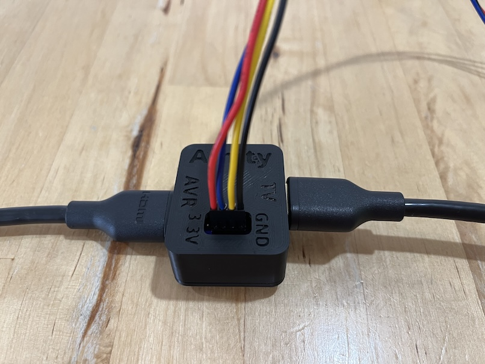

# HDMI-CEC Hardware

!!! Using Amity may destroy your expensive HDMI equipment. Proceed at your own risk !!!

## Amity Board

Amity Board is a 4 layer PCB that includes onboard 27K ohms pullup resistors to conform to the HDMI-CEC specification. When used with the board, Amity must be configured to disable the Raspberry Pi internal GPIO pullup resistors.

### Caveats

Amity Board is experimental. It has been very lightly tested to work for video up to 4K@60Hz Dolby Vision. EMI is unknown, and it may have other unknown bugs. If you are an experienced HW engineer interested in improving the board design, you are invited to submit improvements.

### Preparation

Amity board KiCAD files are [here](board). In the [mfr](board/mfr) folder are the manufacturing files, and an example BOM for submission to a PCB manufacturer/assembler (the BOM will likely need to be tailored to the manufacturer's requirements).

#### BOM

* 2x [HDMI-A connectors](https://www.digikey.com/en/products/detail/amphenol-cs-fci/10029449-001RLF/1001325)
* 2x [0603 SMD 27K ohms resistors](https://www.digikey.com/en/products/detail/bourns-inc/CR0603-JW-273ELF/3784345)
* 2x [0603 SMD diodes](https://www.digikey.com/en/products/detail/taiwan-semiconductor-corporation/TS4148-RCG/7359811)
* 1x [2.54mm 4x connector header](https://www.digikey.com/en/products/detail/würth-elektronik/61300411121/4846827)
* A 4 wire bundle terminated with a 4x1 2.54mm connector, and a 3x2 2.54mm connector, for connecting Amity board to the Raspberry Pi.

#### Wiring and Pinout

Amity board requires 4 wires to the Raspberry Pi - GND, 3.3v, and two CEC GPIO pins. These correspond to pins 14, 17, 16, and 18 on the Raspberry Pi [pinout](https://pinout.xyz).

| Name  | Amity Board Pin # | RPi Pin # | RPi GPIO # |
| ----- | ----------------- | --------- | ---------- |
|  GND  | 1                 | 14        | -          |
| CEC 0 | 2                 | 16        | 23         |
| CEC 1 | 3                 | 18        | 24         |
| 3.3V  | 4                 | 17        | -          |

### Configuring Amity

After [initial installation](../README.md#initial-installation) of Amity, and before plugging in the HDMI connections, Amity must be configured to use the board.

Select the 'Advanced' tab. In the 'HDMI Splice' section press the 'Use with Amity Board' button. When done, The status line should read 'Configured for Amity Board'.

### Wired Up Amity Board

### Wired Up Amity Board in a Case

A STEP file for a 3D printable case is available [here](case/).

### Amity Board Attached to Raspberry Pi 5 with a 3x2 2.54mm connector

## Splicing an HDMI cable

### Caveats

The spliced HDMI cable method does not conform to the HDMI-CEC specification. In particular, HDMI-CEC specifies the use of 27K ohms pullup resistors for the CEC wires. When using the cable, Amity configures the GPIO pins to use the internal ~60K ohms resistors. This is wildly out of spec. for HDMI-CEC but seems to work anyway.

### Preparation

1. Strip an HDMI cable with a sharp knife.
2. Identify, and carefully pull out the CEC, and ground wires without disturbing the other wires in the cable. Identifying the correct wires can be tricky. One way is to buy a cheap labeled HDMI breakout board and two identical HDMI cables. Cut completely through one of the HDMI cables. Attach one half to the breakout board and identify the colors of the ground, and CEC wires by testing continuity with a multimeter between the labeled breakout board pins, and the exposed HDMI wires. Carefully, strip the second HDMI cable and isolate the ground and CEC wires based on the previously identified colors.
3. Cut the CEC wire to create two ends that connect to the Raspberry Pi GPIO pins.
4. DO NOT cut the ground wire - carefully strip the wire, and connect a wire from the Raspberry Pi ground to the intact ground wire.
5. With power off, connect the two CEC wires (one connected to the TV, and the other connected to the receiver) to GPIO pins 23 and 24 on the Raspberry Pi (order doesn't matter). Connect the HDMI splice ground to ground on the Raspberry Pi. These are pins 14, 16, and 18 on the Raspberry Pi [pinout](https://pinout.xyz). Be careful not to miswire the two CEC wires to ground as that could potentially damage the HDMI equipment and the Raspberry Pi!

#### Raspberry Pi Spliced HDMI Cable Pinout

| Name  | Pin # | GPIO # |
| ----- | ----- | ------ |
|  GND  |  14   |   -    |
| CEC 0 |  16   |   23   |
| CEC 1 |  18   |   24   |

### A Spliced HDMI Cable

### A Spliced HDMI Cable Attached to a Raspberry Pi 5

## Changing Between Cable and Board

If changing between a spliced HDMI cable and Amity board, then Amity must be configured accordingly in the 'HDMI Splice' section of the 'Advanced' tab, before connecting the HDMI cables.
