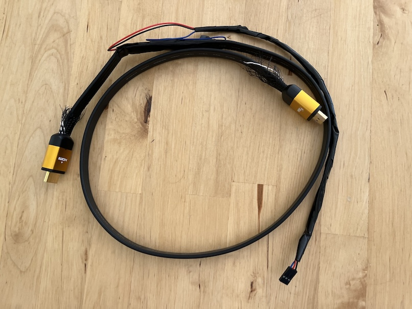
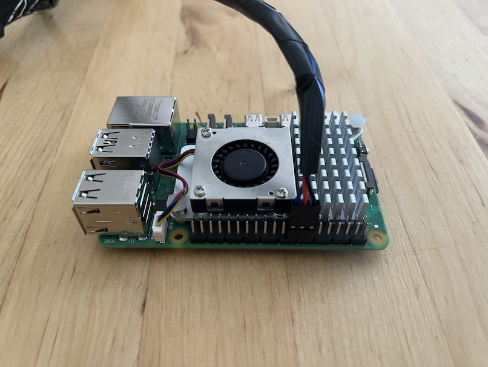

# Splicing an HDMI Cable

!!! Using Amity may destroy your expensive HDMI equipment. Proceed at your own risk !!!

## Caveats

The spliced HDMI cable method does not conform to the HDMI-CEC specification. In particular, HDMI-CEC specifies the use of 27K ohms pullup resistors for the CEC wires. When using the cable, Amity configures the GPIO pins to use the internal ~60K ohms resistors. This is wildly out of spec. for HDMI-CEC but seems to work anyway.

## Preparation

1. Strip an HDMI cable with a sharp knife.
2. Identify, and carefully pull out the CEC, and ground wires without disturbing the other wires in the cable. Identifying the correct wires can be tricky. One way is to buy a cheap labeled HDMI breakout board and two identical HDMI cables. Cut completely through one of the HDMI cables. Attach one half to the breakout board and identify the colors of the ground, and CEC wires by testing continuity with a multimeter between the labeled breakout board pins, and the exposed HDMI wires. Carefully, strip the second HDMI cable and isolate the ground and CEC wires based on the previously identified colors.
3. Cut the CEC wire to create two ends that connect to the Raspberry Pi GPIO pins.
4. DO NOT cut the ground wire - carefully strip the wire, and connect a wire from the Raspberry Pi ground to the intact ground wire.
5. With power off, connect the two CEC wires (one connected to the TV, and the other connected to the receiver) to GPIO pins 23 and 24 on the Raspberry Pi (order doesn't matter). Connect the HDMI splice ground to ground on the Raspberry Pi. These are pins 14, 16, and 18 on the Raspberry Pi [pinout](https://pinout.xyz). Be careful not to miswire the two CEC wires to ground as that could potentially damage the HDMI equipment and the Raspberry Pi!

### Raspberry Pi Spliced HDMI Cable Pinout

| Name  | Pin # | GPIO # |
| ----- | ----- | ------ |
|  GND  |  14   |   -    |
| CEC 0 |  16   |   23   |
| CEC 1 |  18   |   24   |

## A Spliced HDMI Cable

## A Spliced HDMI Cable Attached to a Raspberry Pi 5

## Configuring Amity

After [initial installation](../README.md#initial-installation) of Amity, and before plugging in the HDMI connections, Amity must be configured to use the splicing cable.

Select the 'Advanced' tab. In the 'HDMI Splice' section press the 'Use with a spliced HDMI cable' button. When done, the status line should read 'Configured for a spliced HDMI cable'.
